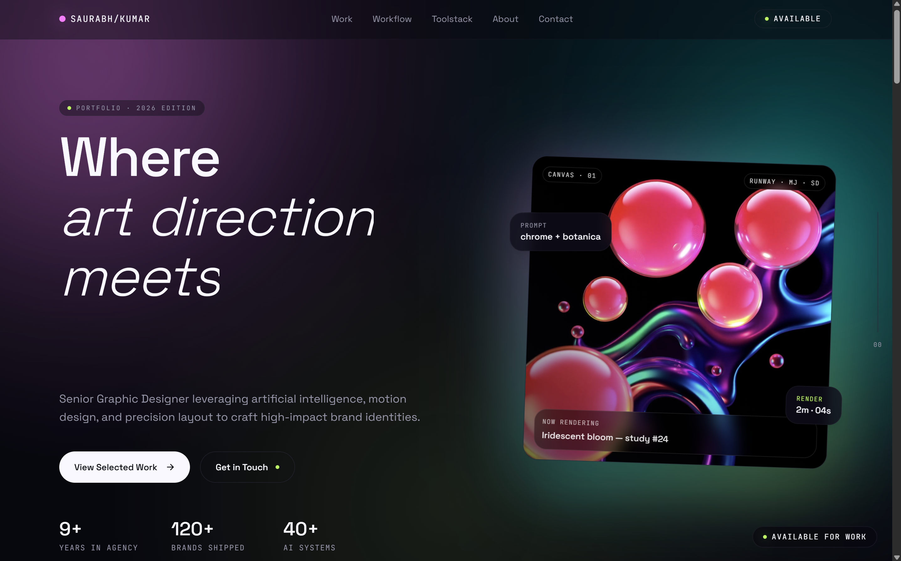

# ⚡ Saurabh Kumar — AI Graphic Designer Portfolio

**Where Fine Arts Precision Meets Generative AI Motion**

[🌐 View Live Site](https://ai-canvas-studio-seven.vercel.app/) • [📩 Contact Me](mailto:hello@skumar.space)

---

## 🎨 Overview

Welcome to the official repository for **Saurabh Kumar's** AI Graphic Design & Motion Portfolio. Built with **Lovable**, this website bridges traditional Fine Arts principles—visual hierarchy, grid discipline, typography, and color theory—with cutting-edge generative AI workflows and modern web motion design.

### ✨ Key Features

* **🎭 Immersive Parallax & Scroll Motion:** High-energy micro-interactions, parallax layers, glowing card tilts, and smooth scroll reveals.
* **📂 Deep Case Study Modals:** In-depth visual breakdowns of design challenges, prompt strategy, and vector/motion refinement.
* **⚡ Interactive Toolstack Filter:** Categorized showcasing of traditional design suites, AI engines, and web prototyping platforms.
* **🛠️ AI Process Timeline:** Interactive step-by-step breakdown from prompt concepting to Photoshop, Figma, and Framer execution.

---

## 📸 Page Preview

*Saurabh Kumar —  AI Graphic Designer & Motion Artist Portfolio*

---

## 🛠️ Tech Stack & Creative Toolkit

| Domain | Tools & Technologies |
| :--- | :--- |
| **Design & Layout** | Adobe Creative Suite (Photoshop, Illustrator, InDesign), Figma, Framer |
| **Generative AI** | Midjourney, Stable Diffusion, Runway, DALL-E, ComfyUI |
| **Motion & Web** | After Effects, Motion Graphics, TailwindCSS, React, Lovable |
| **Core Competencies** | Visual Hierarchy, Kinetic Typography, Editorial Systems, Brand Strategy |

---

## 🎓 Education & Background

* **Degree:** Bachelor's in Fine Arts (BFA in Design)
* **Specialization:** Brand Identity Systems, Motion Graphics, AI Synthesis Workflow

---

## 📬 Get in Touch

I am open to agency opportunities, high-impact brand collaborations, and freelance projects.

* **Email:** [hello@skumar.space](mailto:hello@skumar.space)
* **Website:** [skumar.space](https://skumar.space)